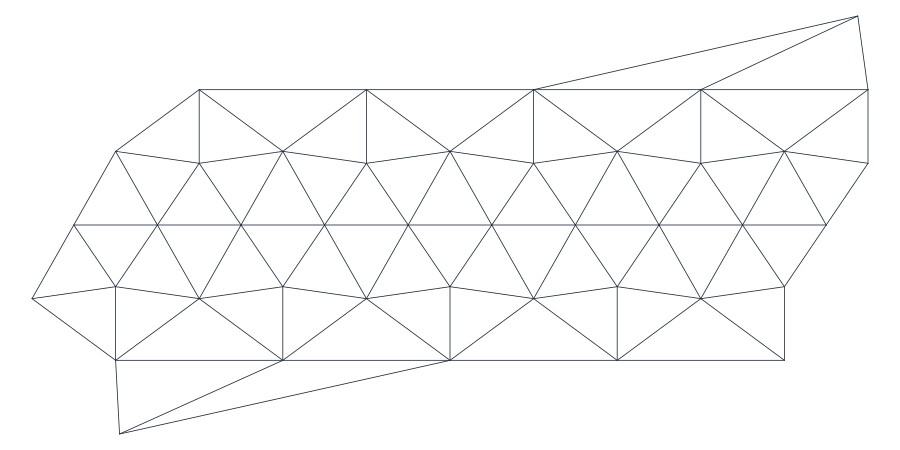
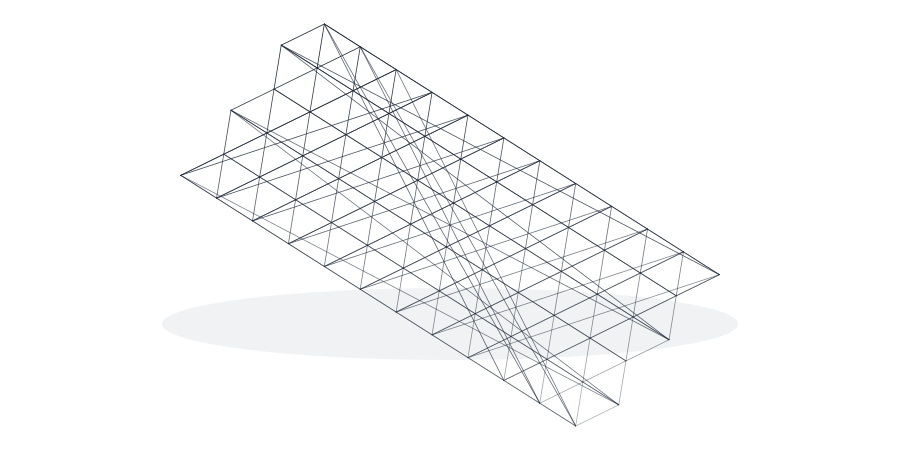
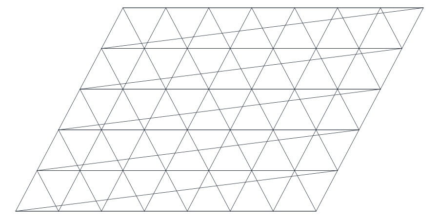
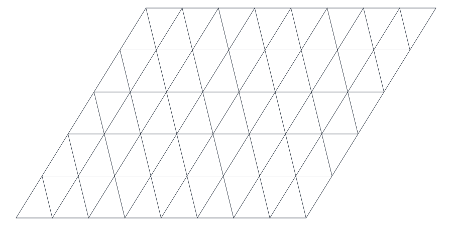
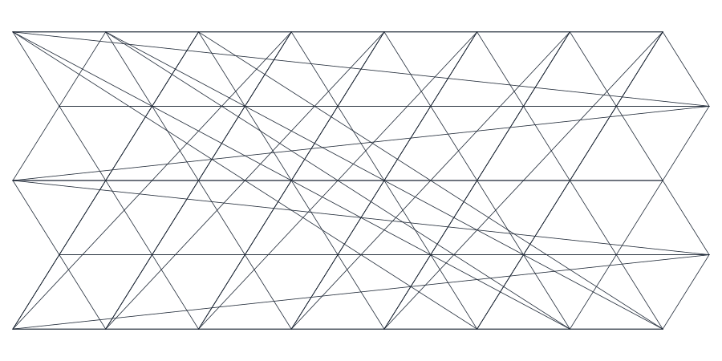
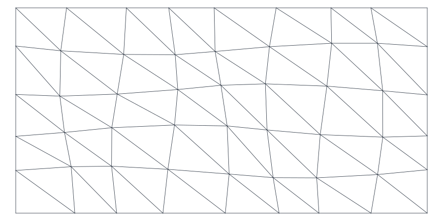
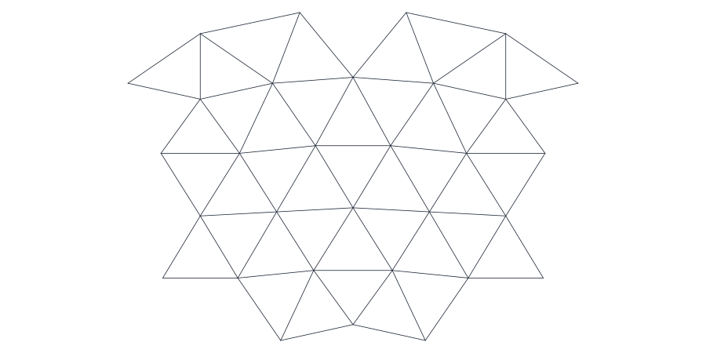
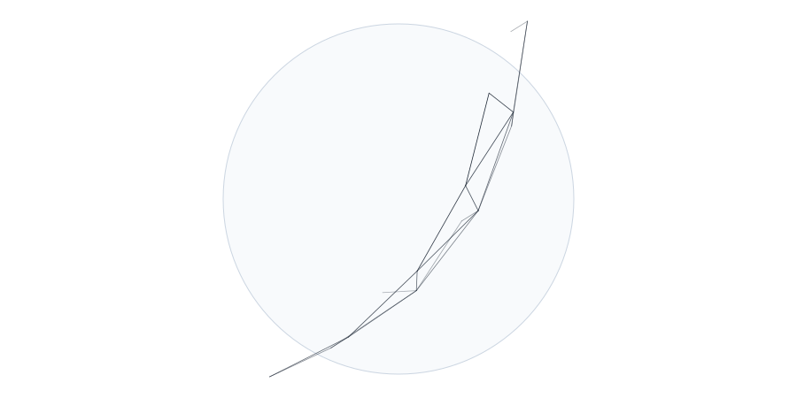

# Examples

The examples below are complete snippets. They use small grids so they are fast
to copy, paste, and run. Each grid-producing example writes a 3D SVG grid plot
with `grid_generator.visualization.write_svg`, and the checked-in figures below
are generated from the same code path.

Regenerate the figures with `make docs-figures`. `make check`, `make package`,
and the release workflow verify that the checked-in figures are current.

## Output Directory

```python
from pathlib import Path

output = Path("grid_examples")
output.mkdir(exist_ok=True)
```

## Global Grid

Use the string shorthand for standard spherical grids. Global grids are
optimized by default.

```python
from pathlib import Path

from grid_generator import generate_grid
from grid_generator.visualization import write_svg

output = Path("grid_examples")
output.mkdir(exist_ok=True)

grid = generate_grid("R1B1", spring_iterations=20)
print(grid.name)
print(grid.dims)
write_svg(grid, output / "global_r1b1.svg", projection="3d")
```



## NetCDF Export

NetCDF export requires installing the optional extra:

```bash
python -m pip install "icon-grid-generator[netcdf]"
```

```python
from pathlib import Path

from grid_generator import generate_grid
from grid_generator.visualization import write_svg

output = Path("grid_examples")
output.mkdir(exist_ok=True)

grid = generate_grid("R1B1", spring_iterations=20)
write_svg(grid, output / "global_r1b1_netcdf.svg", projection="3d")
grid.to_netcdf(output / "icon_grid_R01B01.nc")
```


## Raw Diagnostic Grid

Raw grids skip global optimization. Use this for topology checks, not for normal
grid-file generation.

```python
from pathlib import Path

from grid_generator import generate_grid
from grid_generator.visualization import write_svg

output = Path("grid_examples")
output.mkdir(exist_ok=True)

raw_grid = generate_grid("R1B1", optimize_global=False)
print(raw_grid.metadata["global_optimization"])
write_svg(raw_grid, output / "global_r1b1_raw.svg", projection="3d")
```


## Planar Torus

`TorusGridSpec` creates a doubly periodic planar triangular grid.

```python
from pathlib import Path

from grid_generator import TorusGridSpec, generate_grid
from grid_generator.visualization import write_svg

output = Path("grid_examples")
output.mkdir(exist_ok=True)

grid = generate_grid(TorusGridSpec(nx=12, ny=6, edge_length=1_000.0))
print(grid.name)
print(grid.metadata["domain_length"])
write_svg(grid, output / "planar_torus.svg", projection="3d")
```



## Open Planar Grids

`ChannelGridSpec` and `ParallelogramGridSpec` are useful for local planar
experiments with open boundaries.

```python
from pathlib import Path

from grid_generator import ChannelGridSpec, ParallelogramGridSpec, generate_grid
from grid_generator.visualization import write_svg

output = Path("grid_examples")
output.mkdir(exist_ok=True)

channel = generate_grid(ChannelGridSpec(nx=8, ny=5, edge_length=1_000.0))
parallelogram = generate_grid(
    ParallelogramGridSpec(nx=8, ny=5, edge_length=1_000.0, shear=0.25)
)
write_svg(channel, output / "planar_channel.svg", projection="3d")
write_svg(parallelogram, output / "planar_parallelogram.svg", projection="3d")
```





## Advanced Planar Variants

Advanced but supported planar variants live in `grid_generator.planar`.

```python
from pathlib import Path

from grid_generator import generate_grid
from grid_generator.planar import RaggedOrthogonalGridSpec, StretchedTorusGridSpec
from grid_generator.visualization import write_svg

output = Path("grid_examples")
output.mkdir(exist_ok=True)

stretched = generate_grid(
    StretchedTorusGridSpec(nx=8, ny=5, edge_length=1_000.0, stretch_x=1.4)
)
ragged = generate_grid(RaggedOrthogonalGridSpec(nx=8, ny=5, dx=1_000.0, dy=800.0))
write_svg(stretched, output / "planar_stretched_torus.svg", projection="3d")
write_svg(ragged, output / "planar_ragged_orthogonal.svg", projection="3d")
```





## Limited Area

`LimitedAreaGridSpec` extracts a compact regional grid from a generated global
parent.

```python
from pathlib import Path

from grid_generator import LimitedAreaGridSpec, Region, generate_grid
from grid_generator.visualization import write_svg

output = Path("grid_examples")
output.mkdir(exist_ok=True)

spec = LimitedAreaGridSpec(
    parent="R2B1",
    region=Region.lonlat_box(lon_min=-30.0, lon_max=30.0, lat_min=-20.0, lat_max=35.0),
    boundary_depth=1,
)
grid = generate_grid(spec, spring_iterations=20)
print(grid.name)
print(grid.dims)
write_svg(grid, output / "limited_area.svg", projection="3d")
```



## Cut An Existing Grid

For a single-region cut, pass the region directly.

```python
from pathlib import Path

from grid_generator import Region, generate_grid
from grid_generator.cutting import cut_grid
from grid_generator.visualization import write_svg

output = Path("grid_examples")
output.mkdir(exist_ok=True)

parent = generate_grid("R2B1", spring_iterations=20)
cut = cut_grid(parent, Region.circle(lon=0.0, lat=0.0, radius_degrees=35.0))
print(cut.dims)
write_svg(cut, output / "cut_circle.svg", projection="3d")
```



Use `CutGridSpec` for multiple regions or non-default cut options.

```python
from pathlib import Path

from grid_generator import Region, generate_grid
from grid_generator.cutting import CutGridSpec, cut_grid
from grid_generator.visualization import write_svg

output = Path("grid_examples")
output.mkdir(exist_ok=True)

parent = generate_grid("R2B1", spring_iterations=20)
cut = cut_grid(
    parent,
    CutGridSpec(
        regions=(
            Region.circle(lon=0.0, lat=0.0, radius_degrees=35.0),
            Region.lonlat_box(lon_min=-20.0, lon_max=20.0, lat_min=-15.0, lat_max=15.0),
        ),
        boundary_depth=1,
        smoothing_depth=1,
        name="CUT_MULTI",
    ),
)
write_svg(cut, output / "cut_multi_region.svg", projection="3d")
```


## Diagnostics And Transforms

Diagnostics inspect a grid without changing it. Transforms return a new grid
with unchanged topology.

```python
from pathlib import Path

from grid_generator import ChannelGridSpec, generate_grid
from grid_generator.diagnostics import check_grid, grid_statistics
from grid_generator.transforms import OptimizationOptions, optimize_grid
from grid_generator.visualization import write_svg

output = Path("grid_examples")
output.mkdir(exist_ok=True)

grid = generate_grid(ChannelGridSpec(nx=8, ny=5, edge_length=1_000.0))
check = check_grid(grid)
stats = grid_statistics(grid)
optimized = optimize_grid(grid, OptimizationOptions(iterations=2, relaxation=0.1))

assert check.ok
print(stats.cells, stats.boundary_edges)
write_svg(optimized, output / "optimized_channel.svg", projection="3d")
```


