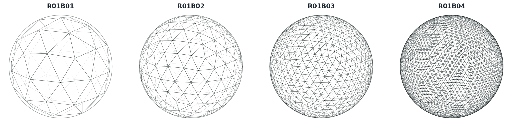

# ICON Grid Generator

ICON Grid Generator is a pure Python package for creating ICON-style triangular
grids without depending on ICON model runtimes or stencil frameworks.



## What It Provides

- Global spherical ICON `R<n>B<k>` grids.
- Planar torus and open planar triangular grids for local experiments.
- Limited-area grids extracted from generated global parent grids.
- ICON-style NetCDF export when the optional `netCDF4` dependency is installed.
- In-memory geometry, topology, connectivity, metric, and refinement arrays for
  plotting, diagnostics, and downstream conversion.

## Basic Usage

```python
from grid_generator import generate_grid

grid = generate_grid("R2B4")
print(grid.name)
print(grid.dims)
grid.to_netcdf("icon_grid_R02B04.nc")
```

Global grids are optimized by default. Pass `optimize_global=False` only for raw
topology diagnostics.

## Which Grid Should I Use?

| Goal | Use |
| --- | --- |
| Standard spherical grid file | `generate_grid("R2B4")` |
| Raw topology checks | `generate_grid("R2B4", optimize_global=False)` |
| Periodic planar experiment | `TorusGridSpec(...)` |
| Regional extract from a global parent | `LimitedAreaGridSpec(...)` |
| Cut an existing grid | `grid_generator.cutting.cut_grid(...)` |

## Project Links

- [Examples](examples.md)
- [API overview](api.md)
- [Design notes and limitations](design.md)
- [Changelog](https://github.com/ofuhrer/icon-grid-generator/blob/main/CHANGELOG.md)
- [Citation metadata](https://github.com/ofuhrer/icon-grid-generator/blob/main/CITATION.cff)
